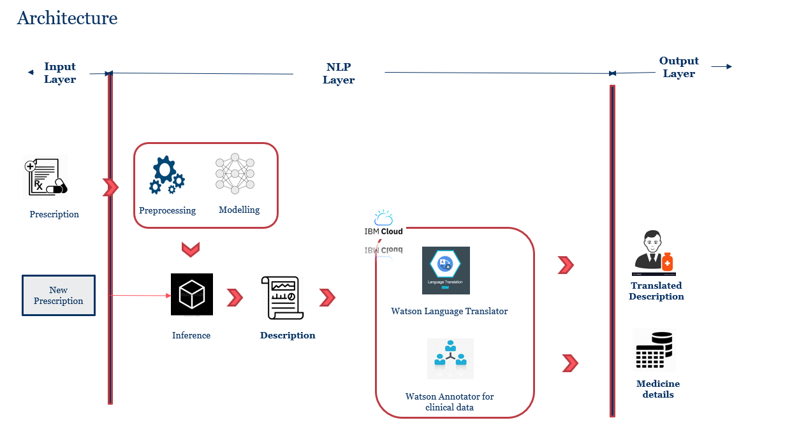
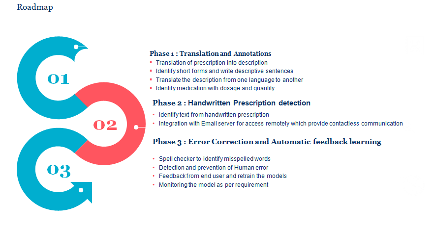

# Submission name

Machine Translation of Medical Transcripts using NLP

## Contents

1. [Short description](#short-description)
1. [Demo video](#demo-video)
1. [The architecture](#the-architecture)
1. [Long description](#long-description)
1. [Project roadmap](#project-roadmap)
1. [Getting started](#getting-started)
1. [Authors](#authors)

## Short description

### What's the problem?

Due to this pandemic situation, doctors have a lot of pressure and they write a prescription in a hurry which is not comprehensive with bare eyes.

### How can technology help?

Our solution will convert the prescription into a more understandable form for patients who can only understand their native language and extracting key annotators like diagnosis, prescription, symptoms for another doctor so that he doesn’t have to spend time going through complete prescription.

### The idea

Our solution converts the prescription into decritpion which can be used to convert it into native language and medical annotator which will help medical stuff with unambiguity and it will save their time.Our solution includes Augmented Intelligence, to reduce the waiting time of patients as well as removing duplicating effort of the doctors from 20 mins to 4 mins

## Demo video

[![Watch the video]](https://youtu.be/WE87ltnuUMM)

## The architecture




## Long description

The world is dealing with Pandemic where they need more and more digital solution to save lives. Doctor writes Prescription for the patient in short notation own language. The prescription reaches the pharmacy. If the Pharmacist is unable to read the prescription, he returns it to the Doctor for Clarification.
•	Our solution includes Augmented Intelligence, to reduce the waiting time of patients as well as removing duplicating effort of the doctors from 20 mins to 4 mins
•	In this pandemic situation, doctors move in different country to help. Language diversity add stress to pharmacist to understand the prescription. Our solution converts the prescription into native language.
•	For future auditing, we provide different entities like medicine name dosage and frequency of tablet for a patient and other details like time of dosage given.
Solution includes NLP/Machine Learning based techniques to provide value to pharma users/ patients.  IBM Watson language translator provide the scalable


## Project roadmap



## Getting started

These instructions will get you a copy of the project up and running on your local machine for development and testing purposes. See deployment for notes on how to deploy the project on a live system.

### Prerequisites

What things you need to install the software and how to install them

```bash
dnf install wget
wget https://github.com/Neeraj-singla/wit-AI-Driven-Translation-of-Medical-prescription
```

### Installing

A step by step series of examples that tell you how to get a development env running

Say what the step will be, for example

```bash
Pip install -r requirements.txt

```

```bash
Python IBM _watson_language_translator.py "input_string" "language-symbol"
Python IBM_watson_medical_annotator.py "input_string"
```

## Authors

* **Neeraj Singla**
* **Varsha Rani**
* **Sonakshi Pattnaik**


## Sincere Request
Since we have developed our solution in office's laptops but due to time limit, we are not able to replicate full code in Git. And due to IT policy restriction in our office, we could not share our full code to out of office premises.
We have tried to show our efforts in demo video. Please refer here https://youtu.be/WE87ltnuUMM.  Please don't disqualify our solution based on this code. We have requested to office IT for transfer code, but it will take few days. If you give us some time, we can provide full solution in few days.
Thank you for your support.


### Files Pending
Model files, asset files and related pickles files are not uploaded because of companies Restriction
